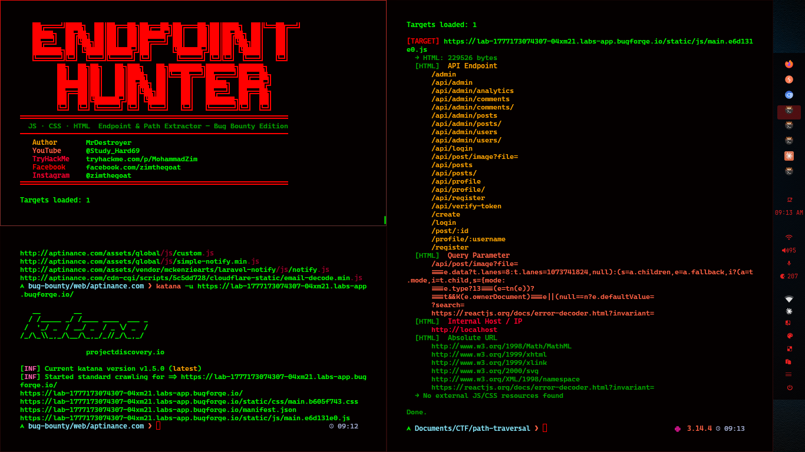

# 🏹 EndpointHunter

**EndpointHunter** is a powerful bug bounty tool designed to hunt and extract API endpoints, LFI paths, secrets, and cloud storage URLs from **JS, CSS, and HTML** files. It's built for efficiency, supporting multi-threaded scanning and seamless integration with other popular recon tools.



---

## ✨ Features

- 🔍 **Extracts:** API Endpoints (v1, graphql, rest, etc.), Query Parameters, LFI/Path Traversal vectors, Secrets (Tokens, Keys, JWT), S3 Buckets, and Internal IPs.
- ⚡ **Multi-threaded:** Fast processing of multiple targets.
- 🔗 **Smart Recon:** Automatically finds and scans linked JS/CSS files from a target HTML page.
- 🛠️ **Pipeline Friendly:** Works perfectly with `cat`, `grep`, `katana`, `gau`, `waybackurls`, etc.
- 🧹 **Noise Reduction:** Automatically filters out common static assets like images, fonts, and icons.

---

## 🚀 Installation

1. Clone the repository:
   ```bash
   git clone https://github.com/MrDestroyer/endpointhunter.git
   cd endpointhunter
   ```

2. Install dependencies:
   ```bash
   pip install requests
   ```

---

## 🛠️ Usage

### 1. Single URL Mode
Scan a single target for hidden endpoints and queries:
```bash
python3 endpointhunter.py -u https://example.com
```

### 2. Multiple URLs (File Input)
Scan a list of URLs from a file:
```bash
cat urls.txt | python3 endpointhunter.py --threads 10
```

### 3. Save Output
Save the extracted findings to a text file:
```bash
python3 endpointhunter.py -u https://example.com -o results.txt
```

---

## 🔗 Bug Bounty Workflow (Chaining Tools)

EndpointHunter is designed to sit in the middle of your recon pipeline.

### Chaining with Katana
Crawl a site and hunt for endpoints in all discovered JS files:
```bash
katana -u https://target.com -d 3 | grep ".js" | python3 endpointhunter.py
```

### Chaining with GAU (Get All URLs)
Fetch historical URLs and pipe them to hunt for secrets:
```bash
gau target.com | grep -E "\.js|\.html" | python3 endpointhunter.py
```

### Chaining with Waybackurls
```bash
waybackurls target.com | grep ".js" | python3 endpointhunter.py
```

---

## 📜 Credit & Author

Developed with ❤️ by **MrDestroyer**. 

- **YouTube:** [@Study_Hard69](https://youtube.com/@Study_Hard69)
- **TryHackMe:** [MohammadZim](https://tryhackme.com/p/MohammadZim)
- **Facebook:** [zimthegoat](https://facebook.com/zimthegoat)
- **Instagram:** [@zimthegoat](https://instagram.com/zimthegoat)

---

## ⭐ Support
If this tool helped you in your bug hunting journey, please **star this repository**! It helps more people discover the tool and keeps me motivated to add more features.

Happy Hunting!
